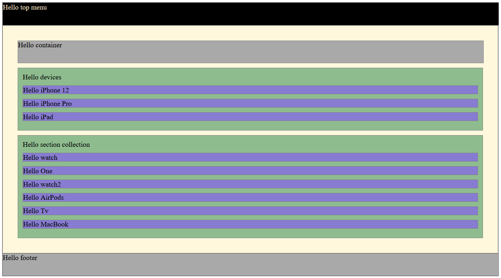

## 1. Instalación de dependencias.

---

En esta parte no vamos a pararnos mucho, pero sí quería dejar claro lo que vamos a estar utilizando en este ejemplo.
Hemos instalado `Sass`, `rimraf` y `Parcel` que no es más que un servidor local de desarrollo que nos ayudará a ser más ágiles en nuestro trabajo y también incluye todo lo necesario para poder utilizar `Sass`.

- Iniciamos el proyecto:
  `npm init -y`
- Instalamos las dependencias:
  `npm install parcel@1.12.3 sass rimraf --save-dev`
- Añadimos el script para arrancar el proyecto en **package.json**
  ```json
  "scripts": {
  	"start": "rimraf dist && parcel ./src/index.html"
  }
  ```

## 2. Creación de la estructura.

---

Una vez conocemos los requisitos y el diseño del proyecto podemos empezar a crear una estructura básica (la cual iremos ampliando) donde poder empezar a colocar y crear nuestros archivos y recursos necesarios.

Este proyecto está definido de la siguiente manera:

- Un directorio raíz llamado `src`, aquí irá por ejemplo nuestro **index.html**.
- Un subdirectorio `assets` donde colocaremos las fuentes, imágenes y todos los recursos estáticos que necesitemos.
- Un subdirectorio `styles` para nuestros estilos css, sass, etc...
- Quedaría algo como esto:

      ```
      SRC
      |   index.html
      |
      |
      +---assets
      |   |   logo.jpg
      |   |
      |   +---fonts
      |   |       SFProDisplay-Bold.ttf
      |   |
      |   \---icons
      |           search.svg
      |
      \---styles
              styles.scss
      ```

## 3. Recopilación de recursos

---

Tener todos los recursos que vamos a necesitar ya importados y listos en nuestro proyecto es algo que nos agilizará mucho el desarrollo.
En un caso real, estos recursos los extraeríamos de nuestro diseño o en el mejor de los casos nos los proporcionaría el diseñador.
Cuando hablo de recursos me refiero a imágenes, fuentes, vídeos, paleta de color, etc.

## 4. Definición html básico.

---

Personalmente me gusta crear una estructura básica de lo que será la página, con esto me refiero, por ejemplo, a añadir un header, un body y un footer inicial a los cuales añado un borde o un fondo para diferenciarlos y luego de la misma forma ir profundizando en cada uno de ellos. Esto no es algo estático ya que según vayamos añadiendo contenido en cada capa surgirán distintas necesidades para la colocación y distribución de los elementos.

Estructura básica inicial:

```html
<body>
	<nav class="container">Hello top menu</nav>
	<main>
		<div class="container">Hello container</div>
		<section class="devices">
			Hello devices
			<div>Hello iPhone 12</div>
			<div>Hello iPhone Pro</div>
			<div>Hello iPad</div>
		</section>
		<section class="collection">
			Hello section collection
			<div>Hello watch</div>
			<div>Hello One</div>
			<div>Hello watch2</div>
			<div>Hello AirPods</div>
			<div>Hello Tv</div>
			<div>Hello MacBook</div>
		</section>
	</main>
	<footer class="container">Hello footer</footer>
</body>
```



## 5. Creación de estilos globales

---

Este punto podemos afrontarlo de dos formas, utilizando CSS o un preprocesador, en nuestro caso Sass.

> En cualquiera de los dos casos vamos a añadir un `_normalize.css` para resetear los estilos que cada navegador implementa por defecto, de esta manera minimizamos las diferencias al mostrar la página en cada uno de ellos.

> \_El guión bajo en el nombre lo utilizo para diferenciar los archivos con estilos globales o variables de los específicos de cada bloque o componente.

> CSS ya admite variables de forma nativa y es soportado por todas la versiones modernas de navegadores. `--myVariable: valor;`

> La principal ventaja a la hora de utilizar variables es que si queremos cambiar por ejemplo un color sólo tendríamos que modificar el valor de esa variable y ya quedaría cambiado en todo el proyecto, rápido y sencillo :-) .

Vamos a crear un archivo llamado `_fonts.scss` para definir nuestras fuentes y otro `_vars.scss` el cual iremos incrementando a lo largo del proyecto, y un archivo principal `styles.scss` que será el que cargue el resto de archivos SCSS y que será llamado en el **html**.

### SASS

**\_fonts.scss**

```scss
@font-face {
	font-family: "SF Pro Display Regular";
	font-style: normal;
	font-weight: 400;
	src: url("../assets/fonts/SFProDisplay-Regular.ttf");
}
@font-face {
	font-family: "SF Pro Display Semibold";
	font-style: normal;
	font-weight: 600;
	src: url("../assets/fonts/SFProDisplay-Semibold.ttf");
}
@font-face {
	font-family: "SF Pro Text Regular";
	font-style: normal;
	font-weight: 400;
	src: url("../assets/fonts/SFProText-Regular.ttf");
}
@font-face {
	font-family: "SF Pro Text Semibold";
	font-style: normal;
	font-weight: 600;
	src: url("../assets/fonts/SFProText-Semibold.ttf");
}
@font-face {
	font-family: "SF Pro Text Bold";
	font-style: normal;
	font-weight: 800;
	src: url("../assets/fonts/SFProText-Bold.ttf");
}
```

**\_vars.scss**

```scss
//colors
$backgroundTopMenu: rgba(0, 0, 0, 0.92);
$primaryLight: #f5f5f7;
$backgroundLight: #fbfbfd;
$primaryDark: #1d1d1f;
$secondary: #86868b;
$secondaryDark: #515154;
$link: #06c;
$linkLight: #2997ff;
$offer: #bf4800;
$dark: #000;
$light: #fff;

//fonts
$SFProTextRegular: "SF Pro Text Regular", "Helvetica", "Arial", sans-serif;
$SFProDisplaySemibold: "SF Pro Display Semibold", "Helvetica", "Arial",
	sans-serif;
$SFProDisplayRegular: "SF Pro Display Regular", "Helvetica", "Arial", sans-serif;
```

Creamos los archivos para el resto de bloques con unos estilos básicos de la estructura de apoyo.

**main.scss**

```scss
@import "./_main-devices.scss";
@import "./_main-collection.scss";

main {
	border: 1px solid black;
	display: block;
	box-sizing: border-box;
	width: 100%;
	padding: 2%;
	margin: 0 auto;
	background-color: cadetblue;

	.online-shop {
		border: 1px solid black;
		display: block;
		box-sizing: border-box;
		width: 100%;
		padding: 2%;
		margin: 0 auto;
		background-color: deeppink;
	}
}
```

**\_main-devices.scss**

```scss
main {
	.devices {
		border: 1px solid black;
		display: block;
		box-sizing: border-box;
		width: 100%;
		padding: 2%;
		margin: 2% auto;
		background-color: deeppink;

		div {
			border: 1px solid black;
			padding: 1%;
			margin: 1% auto;
			background-color: lavenderblush;
		}
	}
}
```

**\_main-collection.scss**

```scss
main {
	.collection {
		border: 1px solid black;
		display: block;
		box-sizing: border-box;
		width: 100%;
		padding: 2%;
		margin: 0 auto;
		background-color: deeppink;

		div {
			border: 1px solid black;
			padding: 1%;
			margin: 1% auto;
			background-color: lavenderblush;
		}
	}
}
```

**footer.scss**

```scss
footer {
	border: 1px solid black;
	display: block;
	box-sizing: border-box;
	width: 100%;
	padding: 2%;
	margin: 0 auto;
	background-color: darkslategray;
	color: white;
}
```

**styles.scss**

```scss
@import "./_normalize.css";
@import "./fonts";
@import "./vars";
@import "./top-menu.scss";
@import "./main.scss";
@import "./footer.scss";

html {
	min-width: 20em;
	font-size: 1rem;
}
```

> _Podemos ver que en los imports hay archivos sin extensión, no siempre es necesario añadirla, aquí aparece así por el formateo que Prettier (extensión para VSCode) le da, para evitar dolores de cabeza si no tienes claro si es necesario ponerla opta por añadirla_.

## 6. Maquetación y estilado por bloques

---

Vamos ha empezar añadiendo el contenido y maquetando cada uno de los bloques de la web.

Será una página responsiva por lo que utilizaremos la metodología **"mobile first"**, es decir, iremos implementando el diseño desde las pantallas para móviles hasta llegar a las de escritorio.

Iremos completando cada uno de los bloques, maquetándolos en todas sus formas y tratándolos de la manera más independiente posible.

> Trabajar de esta manera nos ayudará a centrarnos en resolver un problema concreto sin el ruido que nos pueda generar el resto de elementos.

> Trabajar de manera aislada no significa que nos olvidemos del resto, siempre hay que tener una perspectiva general, por ejemplo, para identificar clases que puedan ser promocionadas a globales o quizás haya bloques que interactúen entre ellos.

### Documentación por partes

- [Top Menu](../01-top-menu/readme.md)
- [Main devices](../02-main-diveces/readme.md)
- [Main collection](../03-main-collection/readme.md)
