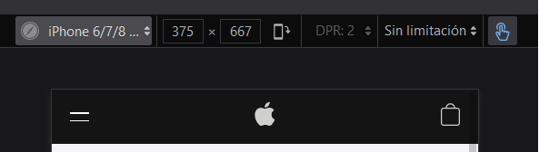
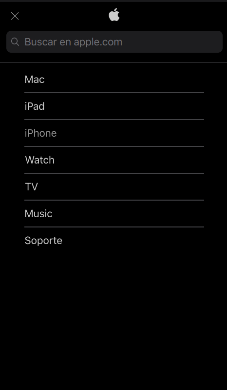
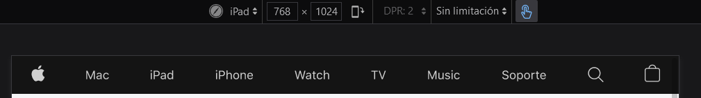
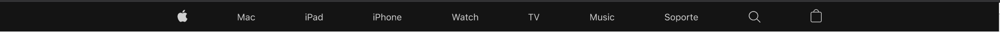

## 6.1 Top Menú

---

Partimos del proyecto anterior **00-boilerplate**.

Vamos a empezar de arriba a abajo así que primero nos fijaremos en el diseño del menú en la vista para dispositivos móviles.

**Vista Top Menu en dispositivos móviles**



**Vista Top Menu desplegado**



**Vista Top Menu en tablets**



**Vista Top Menu en PCs**



La estructura **html** queda de la siguiente forma:

**index.html**

```diff
<!DOCTYPE html>
<html lang="es">
	<head>
		<meta charset="UTF-8" />
		<meta http-equiv="X-UA-Compatible" content="IE=edge" />
		<meta name="viewport" content="width=device-width, initial-scale=1.0" />
		<title>Fusilando Apple</title>
		<script src="index.js"></script>
		<link rel="stylesheet" href="./styles/styles.scss" />
	</head>
	<body>
+		<nav class="container top-menu-container">
+			<ul class="top-menu">
+				<li id="toggle-button" class="item-menu item-open-menu">
+				<span class="menu-line-one">
+					<span></span>
+				</span>
+				<span class="menu-line-two">
+					<span></span>
+				</span>
+				</li>
+				<li class="item-menu item-apple">
+					<a href="#" class="link-icon"><span class="link-text">Apple</span></a>
+				</li>
+				<li class="item-menu item-mac">Mac</li>
+				<li class="item-menu item-ipad">IPad</li>
+				<li class="item-menu item-iphone">IPhone</li>
+				<li class="item-menu item-watch">Watch</li>
+				<li class="item-menu item-tv">TV</li>
+				<li class="item-menu item-music">Music</li>
+				<li class="item-menu item-support">Soporte</li>
+				<li class="item-menu item-search">
+					<a href="#" class="link-icon">
+						<span class="link-text">Buscar</span>
+					</a>
+					<div class="input-container">
+						<a href="#" class="link-icon-movile">
+							<span class="link-text">Buscar</span>
+						</a>
+						<input
+							type="search"
+							class="input-search"
+							placeholder="Buscar en apple.com"
+						/>
+					</div>
+				</li>
+				<li class="item-menu item-store icon-store">
+					<a href="#" class="link-icon"
+						><span class="link-text">Tienda</span></a
+					>
+				</li>
+			</ul>
+		</nav>
		<main>
			Hello main
			<div class="online-shop">Hello online-shop</div>
			<section class="devices">
				Hello devices
				<div>Hello iPhone 12</div>
				<div>Hello iPhone Pro</div>
				<div>Hello iPad</div>
			</section>
			<section class="collection">
				Hello section collection
				<div>Hello watch</div>
				<div>Hello One</div>
				<div>Hello watch2</div>
				<div>Hello AirPods</div>
				<div>Hello Tv</div>
				<div>Hello MacBook</div>
			</section>
		</main>
		<footer class="container">Hello footer</footer>
+		<script>
+			document.querySelector("#toggle-button").addEventListener("click", () => {
+				document
+					.querySelector("#toggle-button")
+					.classList.toggle("item-close-menu");
+				document
+					.querySelector(".top-menu-container")
+					.classList.toggle("collapsed");
+				document
+					.querySelector(".menu-line-one")
+					.classList.toggle("menu-line-one-close");
+				document
+					.querySelector(".menu-line-two")
+					.classList.toggle("menu-line-two-close");
+				document
+					.querySelector(".icon-store")
+					.classList.toggle("icon-store-visibility");
+			});
+		</script>
	</body>
</html>
```

Si analizamos el código vemos que lo primero que añadimos es una etiqueta `<nav>` para dar semántica al contenido, esto ayuda entre otras cosas al posicionamiento y a la accesibilidad dando sentido al contenido.

Para los ítems utilizamos una lista, sin más.

Podemos observar que los ítems que sólo contienen una imagen se les ha añadido una etiqueta `<span>` la cual no se muestra pero es importante en accesibilidad.

Como nota curiosa, observando el código de Apple, me di cuenta que para los botones de abrir y cerrar el menú no utilizan una imagen o icono como suele ser habitual, lo que hacen es utilizar etiquetas `<span>` pintadas con CSS, y así lo hemos implementado.

> Se han añadido unos scripts para el funcionamiento del menú, esto no hace más que añadir el evento `onClick` al botón y mediante selectores añadimos nuevas classes `CSS` que modifican los elementos.

---

### Pasamos al `CSS`.

---

**styles/top-menu.scss**

```diff
-	nav {
-		border: 1px solid black;
-		display: block;
-		box-sizing: border-box;
-		width: 100%;
-		padding: 2%;
-		margin: 0 auto;
-		background-color: darkslategray;
-		color: white;
-	}

+	.top-menu-container {
+		background-color: $backgroundTopMenu;
+		top: 0;
+		max-height: 3.125em;
+		overflow: hidden;
+		box-sizing: border-box;
+		transition: max-height 0.5s ease-out;
+		position: fixed;
+		width: 100%;
+		z-index: 1000;
+	}

+	.top-menu {
+		list-style: none;
+		color: rgba($primaryLight, 0.9);
+		font-family: $SFProTextRegular, Helvetica, Arial, sans-serif;
+		padding: 0.8em 0.5em;
+		margin: -0.625em 0 0 0;
+		display: grid;
+		cursor: pointer;
+		grid-template-areas:
+			"menu apple store"
+			"search search search"
+			"item1 item1 item1"
+			"item2 item2 item2"
+			"item3 item3 item3"
+			"item4 item4 item4"
+			"item5 item5 item5"
+			"item6 item6 item6"
+			"item7 item7 item7";
+		grid-template-columns: 1fr 1fr 1fr;
+		grid-template-rows: 0.5fr 1fr repeat(7, 0.5fr);
+		row-gap: 0.5em;

+		.item-menu {
+			width: 80%;
+			margin: 0 auto;
+			display: flex;
+			padding: 0.625em 0;
+			align-self: center;
+			opacity: 0.8;

+			&:hover {
+				opacity: 1;
+			}

+			.link-text {
+				position: absolute;
+				visibility: hidden;
+			}
+			.link-icon {
+				background-repeat: no-repeat;
+				background-size: contain;
+				background-position: center;
+				height: 1.313em;
+				width: 1.313em;
+				margin: 0 auto;
+				display: block;
+				opacity: 0.8;

+				&:hover {
+					opacity: 1;
+				}
+			}
+		}

+		.item-open-menu {
+			grid-area: menu;
+			display: flex;
+			align-self: center;
+			flex-flow: column;
+			opacity: 0.7;
+			cursor: pointer;
+			gap: 0.4em;

+			.menu-line-one {
+				height: 0.125em;
+				width: 1.063em;
+				border-radius: 0.031em;
+				display: block;
+				background-color: $primaryLight;
+			}
+			.menu-line-two {
+				height: 0.075em;
+				width: 1.063em;
+				border-radius: 0.031em;
+				display: block;
+				background-color: $primaryLight;
+			}
+		}
+		.item-apple {
+			grid-area: apple;
+			.link-icon {
+				background-image: url(../assets/icons/logo-apple.svg);
+			}
+		}

+		.item-mac {
+			grid-area: item1;
+			border-bottom: 2px solid $secondaryDark;
+		}
+		.item-ipad {
+			grid-area: item2;
+			border-bottom: 2px solid $secondaryDark;
+		}
+		.item-iphone {
+			grid-area: item3;
+			border-bottom: 2px solid $secondaryDark;
+		}
+		.item-watch {
+			grid-area: item4;
+			border-bottom: 2px solid $secondaryDark;
+		}
+		.item-tv {
+			grid-area: item5;
+			border-bottom: 2px solid $secondaryDark;
+		}
+		.item-music {
+			grid-area: item6;
+			border-bottom: 2px solid $secondaryDark;
+		}
+		.item-support {
+			grid-area: item7;
+		}
+		.item-search {
+			grid-area: search;
+			border-bottom: 1px solid $secondaryDark;
+			width: 100%;
+			padding: 0.313em 0 0.938em;
+
+			.link-icon {
+				display: none;
+			}

+			.input-container {
+				background-color: $primaryDark;
+				width: 93%;
+				margin: 0 auto;
+				display: flex;
+				justify-content: space-between;
+				align-content: center;
+				flex-flow: row;
+				gap: 0.7em;
+				padding: 0.6em;
+				border-radius: 0.375em;

+				.link-icon-movile {
+					background-image: url(../assets/icons/search.svg);
+					width: 3%;
+					height: 0.875em;
+					width: 0.875em;
+					align-self: center;
+				}
+				.input-search {
+					width: 93%;
+					background-color: $primaryDark;
+					border: none;
+					outline: none;
+					color: rgba($primaryLight, 0.7);
+					font-size: 1.063em;
+					line-height: 1.23536;
+					letter-spacing: -0.022em;
+				}
+			}
+		}

+		.item-store {
+			grid-area: store;
+			display: flex;
+			.link-icon {
+				background-image: url(../assets/icons/bag.svg);
+				margin-right: 0;
+			}
+		}

+		// media query
+		@media (min-width: 760px) {
+			display: flex;
+			flex-flow: row;
+			margin: 0 auto;
+			padding: 0.75em 0;
+			max-width: 66.875em;
+			justify-content: space-around;
+			align-content: center;

+			.item-menu {
+				width: auto;
+				padding: 0;
+				border: none;
+				font-size: 0.875em;
+				margin: 0;

+				.link-icon {
+					margin: 0;
+				}
+			}

+			.item-search {
+				.link-icon {
+					background-image: url(../assets/icons/search.svg);
+					display: block;
+					opacity: 1;
+				}
+				.input-container {
+					display: none;
+				}
+			}

+			#toggle-button,
+			.input-search {
+				display: none;
+			}
+		}
+	}

+	//Collapsed menu styles

+	.collapsed {
+		background-color: $dark;
+		padding-bottom: 100vh;
+		max-height: 100vh;
+		transition: all 0.5s ease-in;
+	}
+	.item-close-menu {
+		gap: 0;
+	}
+	.menu-line-one-close {
+		opacity: 0.8;
+		transform: rotate(45deg);
+	}
+	.menu-line-two-close {
+		opacity: 0.8;
+		height: 0.125em !important;
+		margin-top: -0.52em;
+		transform: rotate(-45deg);
+	}
+	.icon-store-visibility {
+		visibility: hidden;
+	}

```

**Siempre tendremos a mano el diseño como referencia**

Según las especificaciones (supondremos que venían definidas en el diseño) es un menú fijo, con una altura máxima y en la versión para pantallas con un ancho inferior a 768px el menú se convierte en un desplegable manejado por un botón.

Comenzamos con el container principal, la etiqueta `nav`.

**styles/top-menu.scss**

```scss
.top-menu-container {
	background-color: $backgroundTopMenu;
	top: 0;
	max-height: 3.125em;
	overflow: hidden;
	box-sizing: border-box;
	transition: max-height 0.5s ease-out;
	position: fixed;
	width: 100%;
	z-index: 1000;
}
```

El anidamiento de clases que nos permite Sass nos ahorra tiempo a la hora de dar especificidad a los selectores o clases.

La lista de ítems está distribuida en un grid para la vista en dispositivos móviles y para el resto de tamaños cambiamos la propiedad a display: flex; en una sóla línea flex-flow: rows;. Utilizamos un grid por que el orden de los elementos cambia de una vista a otra y así podremos moverlos. En el html los items están puestos en el orden de la vista para pantallas grandes, por eso podemos cambiar el display a flex y todo queda en su sitio, solo tenemos que ocultar los campos que no queremos mostrar.

**styles/top-menu.scss**

```scss
.top-menu {
	list-style: none;
	color: rgba($primaryLight, 0.9);
	font-family: $SFProTextRegular, Helvetica, Arial, sans-serif;
	padding: 0.8em 0.5em;
	margin: -0.625em 0 0 0;
	display: grid;
	cursor: pointer;
	grid-template-areas:
		"menu apple store"
		"search search search"
		"item1 item1 item1"
		"item2 item2 item2"
		"item3 item3 item3"
		"item4 item4 item4"
		"item5 item5 item5"
		"item6 item6 item6"
		"item7 item7 item7";
	grid-template-columns: 1fr 1fr 1fr;
	grid-template-rows: 0.5fr 1fr repeat(7, 0.5fr);
	row-gap: 0.5em;

	.item-menu {
		width: 80%;
		margin: 0 auto;
		display: flex;
		padding: 0.625em 0;
		align-self: center;
		opacity: 0.8;

		&:hover {
			opacity: 1;
		}

		.link-text {
			position: absolute;
			visibility: hidden;
		}
		.link-icon {
			background-repeat: no-repeat;
			background-size: contain;
			background-position: center;
			height: 1.313em;
			width: 1.313em;
			margin: 0 auto;
			display: block;
			opacity: 0.8;

			&:hover {
				opacity: 1;
			}
		}
	}

	.item-open-menu {
		grid-area: menu;
		display: flex;
		align-self: center;
		flex-flow: column;
		opacity: 0.7;
		cursor: pointer;
		gap: 0.4em;

		.menu-line-one {
			height: 0.125em;
			width: 1.063em;
			border-radius: 0.031em;
			display: block;
			background-color: $primaryLight;
		}
		.menu-line-two {
			height: 0.075em;
			width: 1.063em;
			border-radius: 0.031em;
			display: block;
			background-color: $primaryLight;
		}
	}
	.item-apple {
		grid-area: apple;
		.link-icon {
			background-image: url(../assets/icons/logo-apple.svg);
		}
	}

	.item-mac {
		grid-area: item1;
		border-bottom: 2px solid $secondaryDark;
	}
	.item-ipad {
		grid-area: item2;
		border-bottom: 2px solid $secondaryDark;
	}
	.item-iphone {
		grid-area: item3;
		border-bottom: 2px solid $secondaryDark;
	}
	.item-watch {
		grid-area: item4;
		border-bottom: 2px solid $secondaryDark;
	}
	.item-tv {
		grid-area: item5;
		border-bottom: 2px solid $secondaryDark;
	}
	.item-music {
		grid-area: item6;
		border-bottom: 2px solid $secondaryDark;
	}
	.item-support {
		grid-area: item7;
	}
	.item-search {
		grid-area: search;
		border-bottom: 1px solid $secondaryDark;
		width: 100%;
		padding: 0.313em 0 0.938em;

		.link-icon {
			display: none;
		}

		.input-container {
			background-color: $primaryDark;
			width: 93%;
			margin: 0 auto;
			display: flex;
			justify-content: space-between;
			align-content: center;
			flex-flow: row;
			gap: 0.7em;
			padding: 0.6em;
			border-radius: 0.375em;

			.link-icon-movile {
				background-image: url(../assets/icons/search.svg);
				width: 3%;
				height: 0.875em;
				width: 0.875em;
				align-self: center;
			}
			.input-search {
				width: 93%;
				background-color: $primaryDark;
				border: none;
				outline: none;
				color: rgba($primaryLight, 0.7);
				font-size: 1.063em;
				line-height: 1.23536;
				letter-spacing: -0.022em;
			}
		}
	}

	.item-store {
		grid-area: store;
		display: flex;
		.link-icon {
			background-image: url(../assets/icons/bag.svg);
			margin-right: 0;
		}
	}

	// media query
}
```

Para los saltos de tamaños de pantalla utilizamos los media query `@media`.

**styles/top-menu.scss**

```scss
@media (min-width: 760px) {
	display: flex;
	flex-flow: row;
	margin: 0 auto;
	padding: 0.75em 0;
	max-width: 66.875em;
	justify-content: space-around;
	align-content: center;

	.item-menu {
		width: auto;
		padding: 0;
		border: none;
		font-size: 0.875em;
		margin: 0;

		.link-icon {
			margin: 0;
		}
	}

	.item-search {
		.link-icon {
			background-image: url(../assets/icons/search.svg);
			display: block;
			opacity: 1;
		}
		.input-container {
			display: none;
		}
	}

	#toggle-button,
	.input-search {
		display: none;
	}
}
```

**styles/top-menu.scss**

```scss
//Collapsed menu styles

.collapsed {
	background-color: $dark;
	padding-bottom: 100vh;
	max-height: 100vh;
	transition: all 0.5s ease-in;
}
.item-close-menu {
	gap: 0;
}
.menu-line-one-close {
	opacity: 0.8;
	transform: rotate(45deg);
}
.menu-line-two-close {
	opacity: 0.8;
	height: 0.125em !important;
	margin-top: -0.52em;
	transform: rotate(-45deg);
}
.icon-store-visibility {
	visibility: hidden;
}
```

### Analicemos el código.

La principal ventaja a la hora de utilizar variables es que si queremos cambiar por ejemplo un color sólo tendríamos que modificar el valor de esa variable y ya quedaría cambiado en todo el proyecto, rápido y sencillo :-) .

El anidamiento de clases que nos permite `Sass` nos ahorra tiempo a la hora de dar especificidad a los selectores o clases.

La lista de ítems está distribuida en un `grid` para la vista en dispositivos móviles y para el resto de tamaños cambiamos la propiedad a `display: flex;` en una sóla línea `flex-flow: rows;`. Utilizamos un `grid` por que el orden de los elementos cambia de una vista a otra y así podremos moverlos. En el html los items están puestos en el orden de la vista para pantallas grandes, por eso podemos cambiar el display a flex y todo queda en su sitio, solo tenemos que ocultar los campos que no queremos mostrar.

Para los saltos de tamaños de pantalla utilizamos los media query `@media`.

**_Cuando utilizamos el buscador se debería mostrar otro desplegable, esto no está implementado por no añadir más `javaScript` y meter ruido innecesario. Un planteamiento sería añadir una nueva capa la cual mostrar u ocultar al utilizar el buscador._**
