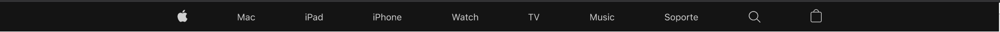

# Fusilando Apple

En este ejemplo veremos cómo maquetar una página web desde cero.

Los pasos que vamos a seguir son:

- Instalación de dependencias necesarias.
- Creación de una estructura aproximada de archivos y directorios.
- Recopilación de recursos (imágenes, fuentes, etc..).
- Definición html de la estructura básica de la página (sin estilos).
- Definición de estilos generales (colores y tipografías principalmente).
- Maquetación y estilado por bloques o componentes de nuestra página.

## 1. Instalación de dependencias.

---

En esta parte no vamos a pararnos mucho, es algo que se verá más adelante, pero sí quería dejar claro lo que vamos a estar utilizando en este ejemplo.
Hemos instalado `Parcel` que no es más que un servidor local de desarrollo que nos ayudará a ser más ágiles en nuestro trabajo y también incluye todo lo necesario para poder utilizar `Sass`.

## 2. Creación de la estructura.

---

Una vez conocemos los requisitos y el diseño del proyecto podemos empezar a crear una estructura básica (la cual iremos ampliando) donde poder empezar a colocar y crear nuestros archivos y recursos necesarios.

Este proyecto está definido de la siguiente manera:

- Un directorio raíz llamado `src`, aquí irá por ejemplo nuestro **index.html**.
- Un subdirectorio `assets` donde colocaremos las fuentes, imágenes y todos los recursos estáticos que necesitemos.
- Un subdirectorio `styles` para nuestros estilos css, sass, etc...
- Quedaría algo como esto:

      ```
      SRC
      |   index.html
      |   index.js
      |
      +---assets
      |   |   logo.jpg
      |   |
      |   +---fonts
      |   |       SFProDisplay-Bold.ttf
      |   |
      |   \---icons
      |           search.svg
      |
      \---styles
              styles.scss
      ```

## 3. Recopilación de recursos

---

Tener todos los recursos que vamos a necesitar ya importados y listos en nuestro proyecto es algo que nos agilizará mucho el desarrollo.
En un caso real, estos recursos los extraeríamos de nuestro diseño o en el mejor de los casos nos los proporcionaría el diseñador.
Cuando hablo de recursos me refiero a imágenes, fuentes, vídeos, paleta de color, etc.

## 4. Definición html básico.

---

Personalmente me gusta crear una estructura básica de lo que será la página, con esto me refiero, por ejemplo, a añadir un header, un body y un footer inicial a los cuales añado un borde o un fondo para diferenciarlos y luego de la misma forma ir profundizando en cada uno de ellos. Esto no es algo estático ya que según vayamos añadiendo contenido en cada capa surgirán distintas necesidades para la colocación y distribución de los elementos.

Estructura básica inicial:

```html
<body>
	<nav class="container">Hello top menu</nav>
	<main>
		<div class="container">Hello container</div>
		<section class="container">Hello section iPhone 12</section>
		<section class="container">Hello section iPhone 12 pro</section>
		<section class="container">Hello section iPad Air</section>
		<section class="container">Hello section watch and more</section>
		<section class="container">Hello section watch and more</section>
	</main>
	<footer class="container">Hello footer</footer>
</body>
```

## 5. Creación de estilos globales

---

Este punto lo podemos afrontar de dos formas, una si utilizamos CSS y otra si utilizamos Sass.

> En cualquiera de los dos casos vamos a añadir un `_normalize.css` para resetear los estilos que cada navegador implementa por defecto, de esta manera minimizamos las diferencias al mostrar la página en cada uno de ellos.

> _El guión bajo en el nombre lo utilizo para diferenciar los archivos con estilos globales o variables de los específicos de cada bloque o componente... a parte de por convención_ :-)

Si optamos por usar CSS crearemos un archivo `_global.css` que tendrá las clases e Ids globales para títulos, párrafos, enlaces, etc... otro para las fuentes `_fonts.css` y uno principal llamado `styles.css` que será el que cargue el resto de CSSs y el cual será llamado en el **html**.

Quedaría algo así:

### CSS

**\_fonts.css**

```css
@font-face {
	font-family: "SF Pro Display Regular";
	font-style: normal;
	font-weight: 400;
	src: url("../assets/fonts/SFProDisplay-Regular.ttf");
}
@font-face {
	font-family: "SF Pro Display Semibold";
	font-style: normal;
	font-weight: 600;
	src: url("../assets/fonts/SFProDisplay-Semibold.ttf");
}
@font-face {
	font-family: "SF Pro Text Regular";
	font-style: normal;
	font-weight: 400;
	src: url("../assets/fonts/SFProText-Regular.ttf");
}
@font-face {
	font-family: "SF Pro Text Semibold";
	font-style: normal;
	font-weight: 600;
	src: url("../assets/fonts/SFProText-Semibold.ttf");
}
@font-face {
	font-family: "SF Pro Text Bold";
	font-style: normal;
	font-weight: 800;
	src: url("../assets/fonts/SFProText-Bold.ttf");
}
```

**\_global.css**

```css
@import './_fonts.css';

.title {
      font-family: 'SF Pro Display Regular',
      color: #000,
      ....
}
.subtitle {
      ....
}
```

**styels.css**

```css
@import "./_normalize.css";
@import '_fonts.css';
@import '_global.css';

...
```

Como se puede observar el CSS que define las fuentes lo hemos **importado** en `_global.css` para poder utilizarlo. Esto es algo que iremos viendo y repitiendo durante el ejercicio con los distintos estilos de cada bloque, de esta manera sólo necesitaremos añadir a nuestro **html** un único archivo.

Nosotros vamos a trabajar con `Sass` y será de una manera similar a la anterior solo que aquí vamos a poder utilizar variables como en cualquier lenguage de programación convencional.

Más adelante iremos viendo las virtudes y la potencia de utilizar un preprocesador para nuestros estilos pero de momento nos centraremos en definir nuestras variables.

Vamos a crear un archivo llamado `_vars.scss` donde importaremos `_fonts.css` y el cual iremos incrementando a lo largo del proyecto, y un archivo principal `styles.scss` que será el que cargue el resto de archivos SCSS y que será llamado en el **html**.

### SASS

**\_vars.scss**

```scss
@import "./_fonts.css";

//Fonts
$title: "SF Pro Display Regular";

//colors
$primary: rgba(0, 0, 0, 0.92);
$secondary: #f5f5f7;
$textDark: #1d1d1f;
$textGrey: #86868b;
$textGreyDark: #515154;
$link: #06c;
```

**styles.scss**

```scss
@import "./_normalize.css";
@import './_fonts.scss';
@import './vars.scss';

...
```

## 6. Maquetación y estilado por bloques

---

Vamos ha empezar añadiendo el contenido y maquetando cada uno de los bloques de la web.

Será una página responsiva por lo que utilizaremos la metodología **"mobile first"**, es decir, iremos implementando el diseño desde las pantallas para móviles hasta llegar a las de escritorio.

Iremos completando cada uno de los bloques, maquetándolos en todas sus formas y tratándolos de la manera más independiente posible.

> Trabajar de esta manera nos ayudará a centrarnos en resolver un problema concreto sin el ruido que nos pueda generar el resto de elementos.

> Trabajar de manera aislada no significa que nos olvidemos del resto, siempre hay que tener una perspectiva general, por ejemplo, para identificar clases que puedan ser promocionadas a globales o quizás haya bloques que interactúen entre ellos.

<br/>

### 6.1 Top Menú

---

Vamos a empezar de arriba a abajo así que primero nos fijaremos en el diseño del menú en la vista para dispositivos móviles.

**Vista Top Menu en dispositivos móviles**


**Vista Top Menu desplegado**


**Vista Top Menu en tablets**


**Vista Top Menu en PCs**



La estructura **html** queda de la siguiente forma:

**index.html**

```html
<!DOCTYPE html>
<html lang="es">
	<head>
		<meta charset="UTF-8" />
		<meta http-equiv="X-UA-Compatible" content="IE=edge" />
		<meta name="viewport" content="width=device-width, initial-scale=1.0" />
		<title>Fusilando Apple</title>
		<script src="index.js"></script>
		<link rel="stylesheet" href="./styles/styles.scss" />
	</head>
	<body>
		<nav class="container top-menu-container">
			<ul class="top-menu">
				<li id="toggle-button" class="item-menu item-open-menu">
					<span class="menu-line-one">
						<span></span>
					</span>
					<span class="menu-line-two">
						<span></span>
					</span>
					<span class="link-text">Mostrar y Ocultar menú</span>
				</li>
				<li class="item-menu item-apple">
					<a href="#" class="link-icon"><span class="link-text">Apple</span></a>
				</li>
				<li class="item-menu item-mac">Mac</li>
				<li class="item-menu item-ipad">IPad</li>
				<li class="item-menu item-iphone">IPhone</li>
				<li class="item-menu item-watch">Watch</li>
				<li class="item-menu item-tv">TV</li>
				<li class="item-menu item-music">Music</li>
				<li class="item-menu item-support">Soporte</li>
				<li class="item-menu item-search">
					<a href="#" class="link-icon">
						<span class="link-text">Buscar</span>
					</a>
					<div class="input-container">
						<a href="#" class="link-icon-movile">
							<span class="link-text">Buscar</span>
						</a>
						<input
							type="search"
							class="input-search"
							placeholder="Buscar en apple.com"
						/>
					</div>
				</li>
				<li class="item-menu item-store icon-store">
					<a href="#" class="link-icon"
						><span class="link-text">Tienda</span></a
					>
				</li>
			</ul>
		</nav>
		<main></main>
		<footer></footer>
	</body>
	<!-- Functions navigate menu in moviles -->
	<script>
		document.querySelector("#toggle-button").addEventListener("click", () => {
			document
				.querySelector("#toggle-button")
				.classList.toggle("item-close-menu");
			document
				.querySelector(".top-menu-container")
				.classList.toggle("collapsed");
			document
				.querySelector(".menu-line-one")
				.classList.toggle("menu-line-one-close");
			document
				.querySelector(".menu-line-two")
				.classList.toggle("menu-line-two-close");
			document
				.querySelector(".icon-store")
				.classList.toggle("icon-store-visibility");
		});
	</script>
</html>
```

Si analizamos el código vemos que lo primero que añadimos es una etiqueta `<nav>` para dar semántica al contenido, esto ayuda entre otras cosas al posicionamiento y a la accesibilidad dando sentido al contenido.

Para los ítems utilizamos una lista, sin más.

Podemos observar que los ítems que sólo contienen una imagen se les ha añadido una etiqueta `<span>` la cual no se muestra pero es importante en accesibilidad.

Como nota curiosa, observando el código de Apple, me di cuenta que para los botones de abrir y cerrar el menú no utilizan una imagen o icono que suele ser lo habitual, sino que son simples etiquetas `<span>` pintadas con CSS, y así lo hemos implementado.

> Se han añadido unos scripts para el funcionamiento del menú, esto no hace más que añadir el evento `onClick` al botón y mediante selectores añadimos nuevas classes `CSS` que modifican los elementos.

### Pasamos al `CSS`.

Ya teníamos creado:

- `_fonts.scss`, donde están definidas las fuentes que necesitamos.
- `_vars.scss`, donde definimos las variables.
- `styles.scss`, hoja de estilos principal.

Y ahora vamos a añadir una hoja de estilos más:

- `top-menu.scss`, hoja de estilos específica del menú de navegación.

Esta nueva hoja de estilos tenemos que importarla en la principal ya que es la que se carga en el html.

**styles.scss**

```scss
@import "./_normalize.css";
@import "./vars";
@import "./fonts";
@import "./top-menu.scss";

...

```

> _Podemos ver que en los imports hay archivos sin extensión, no siempre es necesario añadirla, aquí aparece así por el formateo que Prettier (extensión para VSCode) le da, para evitar dolores de cabeza si no tienes claro si es necesario ponerla opta por añadirla_.

En `_vars.scss` hemos añadido una nueva variable que es un estilo de fuente

**\_vars.scss**

```scss
//colors
$primary: rgba(0, 0, 0, 0.92);
$secondary: #f5f5f7;
$textDark: #1d1d1f;
$textGrey: #86868b;
$textGreyDark: #515154;
$link: #06c;
$black: #000;
$white: #fff;

//fonts
$itemMenuFont: "SF Pro Text Regular";
```

Y por último el código para el top menu.

**top-menu.scss**

```scss
@import "./vars";

.top-menu-container {
	background-color: $primary;
	top: 0;
	max-height: 3.125em;
	overflow: hidden;
	box-sizing: border-box;
	transition: max-height 0.5s ease-out;
	position: fixed;
	width: 100%;
	z-index: 1000;
}

.top-menu {
	list-style: none;
	color: rgba($secondary, 0.9);
	font-family: $itemMenuFont, Helvetica, Arial, sans-serif;
	padding: 0.8em 0.5em;
	margin: -0.625em 0 0 0;
	display: grid;
	cursor: pointer;
	grid-template-areas:
		"menu apple store"
		"search search search"
		"item1 item1 item1"
		"item2 item2 item2"
		"item3 item3 item3"
		"item4 item4 item4"
		"item5 item5 item5"
		"item6 item6 item6"
		"item7 item7 item7";
	grid-template-columns: 1fr 1fr 1fr;
	grid-template-rows: 0.5fr 1fr repeat(7, 0.5fr);
	row-gap: 0.5em;

	.item-menu {
		width: 80%;
		margin: 0 auto;
		display: flex;
		padding: 0.625em 0;
		align-self: center;
		opacity: 0.8;

		&:hover {
			opacity: 1;
		}

		.link-text {
			position: absolute;
			visibility: hidden;
		}
		.link-icon {
			background-repeat: no-repeat;
			background-size: contain;
			background-position: center;
			height: 1.313em;
			width: 1.313em;
			margin: 0 auto;
			display: block;
			opacity: 0.8;

			&:hover {
				opacity: 1;
			}
		}
	}

	.item-open-menu {
		grid-area: menu;
		display: flex;
		align-self: center;
		flex-flow: column;
		opacity: 0.7;
		cursor: pointer;
		gap: 0.4em;

		.menu-line-one {
			height: 0.125em;
			width: 1.063em;
			border-radius: 0.031em;
			display: block;
			background-color: $secondary;
		}
		.menu-line-two {
			height: 0.075em;
			width: 1.063em;
			border-radius: 0.031em;
			display: block;
			background-color: $secondary;
		}
	}
	.item-apple {
		grid-area: apple;
		.link-icon {
			background-image: url(../assets/icons/logo-apple.svg);
		}
	}

	.item-mac {
		grid-area: item1;
		border-bottom: 2px solid $textGreyDark;
	}
	.item-ipad {
		grid-area: item2;
		border-bottom: 2px solid $textGreyDark;
	}
	.item-iphone {
		grid-area: item3;
		border-bottom: 2px solid $textGreyDark;
	}
	.item-watch {
		grid-area: item4;
		border-bottom: 2px solid $textGreyDark;
	}
	.item-tv {
		grid-area: item5;
		border-bottom: 2px solid $textGreyDark;
	}
	.item-music {
		grid-area: item6;
		border-bottom: 2px solid $textGreyDark;
	}
	.item-support {
		grid-area: item7;
	}
	.item-search {
		grid-area: search;
		border-bottom: 1px solid $textGreyDark;
		width: 100%;
		padding: 0.313em 0 0.938em;

		.link-icon {
			display: none;
		}

		.input-container {
			background-color: $textDark;
			width: 93%;
			margin: 0 auto;
			display: flex;
			justify-content: space-between;
			align-content: center;
			flex-flow: row;
			gap: 0.7em;
			padding: 0.6em;
			border-radius: 0.375em;

			.link-icon-movile {
				background-image: url(../assets/icons/search.svg);
				width: 3%;
				height: 0.875em;
				width: 0.875em;
				align-self: center;
			}
			.input-search {
				width: 93%;
				background-color: $textDark;
				border: none;
				outline: none;
				color: rgba($secondary, 0.7);
				font-size: 1.063em;
				line-height: 1.23536;
				letter-spacing: -0.022em;
			}
		}
	}

	.item-store {
		grid-area: store;
		display: flex;
		.link-icon {
			background-image: url(../assets/icons/bag.svg);
			margin-right: 0;
		}
	}

	@media (min-width: 760px) {
		display: flex;
		flex-flow: row;
		margin: 0 auto;
		padding: 0.75em 0;
		max-width: 66.875em;
		justify-content: space-around;
		align-content: center;

		.item-menu {
			width: auto;
			padding: 0;
			border: none;
			font-size: 0.875em;
			margin: 0;

			.link-icon {
				margin: 0;
			}
		}

		.item-search {
			.link-icon {
				background-image: url(../assets/icons/search.svg);
				display: block;
				opacity: 1;
			}
			.input-container {
				display: none;
			}
		}

		#toggle-button,
		.input-search {
			display: none;
		}
	}
}

//Collapsed menu styles

.collapsed {
	background-color: $black;
	padding-bottom: 100vh;
	max-height: 100vh;
	transition: all 0.5s ease-in;
}
.item-close-menu {
	gap: 0;
}
.menu-line-one-close {
	opacity: 0.8;
	transform: rotate(45deg);
}
.menu-line-two-close {
	opacity: 0.8;
	height: 0.125em !important;
	margin-top: -0.52em;
	transform: rotate(-45deg);
}
.icon-store-visibility {
	visibility: hidden;
}
```

### Analicemos el código.

Lo primero que vemos es el import de las variables, la principal ventaja a la hora de utilizar variables es que si queremos cambiar por ejemplo un color sólo tendríamos que modificar el valor de esa variable y ya quedaría cambiado en todo el proyecto, rápido y sencillo :-) .

Cada parte de la página tiene una clase `container` donde se definen los estilos que afectan a todos los elementos por igual como puede ser el ancho. En este caso se ha tenido que añadir una clase específica para el color de fondo.

El anidamiento de clases que nos permite `Sass` nos ahorra tiempo a la hora de dar especificidad a los selectores o clases.

La lista de ítems está distribuida en un `grid` para la vista en dispositivos móviles y para el resto de tamaños cambiamos la propiedad a `display: flex;` en una sóla línea `flex-flow: rows;`. Utilizamos un `grid` por que el orden de los elementos cambia de una vista a otra y así podremos moverlos. En el html están puestos en el orden de la vista para pantallas grandes, por eso podemos cambiar el display a flex para que todo quede en su sitio y ocultar los campos que no deben ser mostrados.

Para los saltos de tamaños de pantalla utilizamos los media query `@media`.

Cuando utilizamos el buscador se debería mostrar otro desplegable, esto no está implementado por no añadir más `javaScript` y meter ruido innecesario. Un planteamiento sería añadir una nueva capa la cual mostrar u ocultar al utilizar el buscador.

La colocación, márgenes, espaciados entre elementos, tamaños, etc... son valores de las propiedas que vamos añadiendo y que tendremos que ir probando hasta ajustar nuestro desarrollo lo más fielmente posible al diseño. Para esto vamos a utilizar valores relativos `em`, `rem` y `%` evitando siempre que sea posible el uso de valores absolutos en `px`.

Los valores `rem` utilizan como referencia el `font-size` definido en el elemento raíz del documento `<html>`, es decir si definimos en esta etiqueta un `font-size: 16px` en el resto del documento `1rem` sera equivalente a `16px`.

Los valores `em` funcionan igual que `rem` pero relativos al primer `font-size` que se encuentre definido en su contenedor padre. Lo vemos mejor con un ejemplo.

Tenemos el siguiente html:

```html
<html>
	<body>
		<div class="container">
			<p>Soy un elemento hijo de .container</p>
		</div>
	</body>
</html>
```

Y su CSS:

```css
html {
	font-size: 100%; /* 100% = 16px */
}
div.container {
	font-size: 2em;
}
p {
	font-size: 1em;
}
```

Aquí el equivalente en `px` para `div.container` es de `32px` ya que su referencia es el `font-size` de `<html>` pero para `<p>` su referente es `<div class="container">` y su `font-size: 1em;` en `px` es `32px` ya que toma como referencia su contenedor padre más directo.

Si cambiamos en `<p>` su valor a `1rem` su `font-size` en pixels pasaría a ser de `16px`.

> Utilizaremos `em` para conseguir componentes aislados y así poder reutilizarlos.

> Utilizaremos `rem` para establecer el valor inicial desde el componente raíz de nuestro documento.

> La combinación de ambos tipos de valores y su utilización a la hora de definir márgenes o paddings harán que consigamos un diseño mucho más flexible y responsivo ya que todo se adaptara de manera proporcional al elemento clave.

Siempre habrá variaciones respecto al diseño original, sobre todo en los textos ya que no es lo mismo ajustar un texto en Photoshop o Illustrator que mediante código. La flexibilidad que nos dan estos programas no la tenemos en CSS, por eso es conveniente que tanto diseñador como programador conozcan un poco el trabajo de ambas partes, por que nada es imposible pero sí poco rentable por muy bonito que sea ;-) .

Los iconos están añadidos mediante CSS con la propiedad `background-image` también se podrían haber añadido como elemento `<image>` en el html. Hemos utilizado el formato `.svg`, este formato nos brinda la ventaja de escalado sin pérdida y la posibilidad de cambiar ciertas propiedades como el color mediante código si lo incluimos como etiqueta html.

> _Toda imagen basada en mapa de bits (píxeles) sufre pérdida de calidad y definición al ser escalada. Esto es mucho más evidente cuando el escalado es de ampliación._

> _Las imágenes vectoriales están formadas por vectores. Un vector es un objeto geométrico definido mediante cálculos matemáticos, esta es la razón por la que este tipo de imágenes no tiene pérdidas de calidad al ser escaladas. Una fuente o tipografía es un ejemplo claro de imágen vectorial._

Los comentarios en el código nos ayudan en su mantenimiento. Al final del documento encontramos uno y seguido una serie de clases. Como indicamos, estas clases son las que utilizamos de manera dinámica para mostrar el menú. Están añadidas al final de manera premeditada, de esta forma es más fácil evitar conflictos y sobreescribir propiedades.

<br/>

### 6.2 Main

---

[**Vista main en dispositivos móviles**](public/main-movile.png)

[**Vista main en tablets**](public/main-tablet.png)

[**Vista main para PC**](public/main-desktop.png)

Si nos fijamos en el [diseño general](public/desktop-design.png) vemos que los enlaces tienen diferentes estilos en el main y en footer por lo que definiremos estos dentro de su bloque correspondiente.

### 6.2.1 Texto compra online.

El primer bloque que nos encontramos es un pequeño texto con un enlace `Compra online`.

> Definimos los estilos generales para los enlaces de este bloque.

**index.html**

```html
<main>
	<div class="online-shop-container section">
		<span class="link">Compra online</span> con la ayuda de un Especialista y
		disfruta de envío gratuito sin contacto físico.
	</div>
	<section class="container iphone"></section>
	<section class="container collection"></section>
</main>
```

**main.scss**

```scss
@import "./vars";

main {
	width: 100%;

	.link {
		color: $link;
		text-decoration: none;
		cursor: pointer;
	}

	.online-shop-container {
		background-color: $backgroundGrey;
		color: $textDark;
		width: 80%;
		max-width: 600px;
		padding: 10px 0;
		margin: 0 auto;
		box-sizing: border-box;
		text-align: center;
		line-height: 1.47059;
		letter-spacing: -0.022em;
		font-family: "SF Pro Text Regular";
		font-size: 14px;

		@media (min-width: 760px) {
			padding: 12px 0;
		}
	}
}
```

### 6.2.2 Sección iPhone y iPhone Pro
